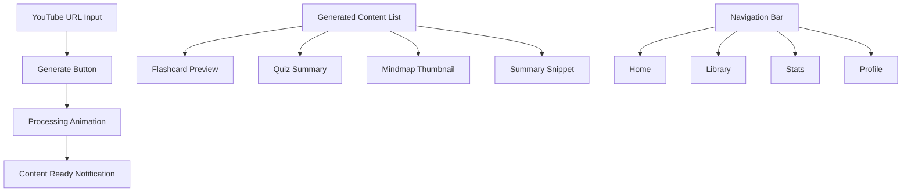
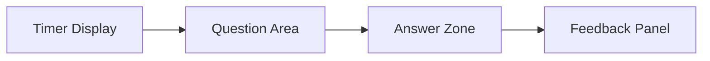
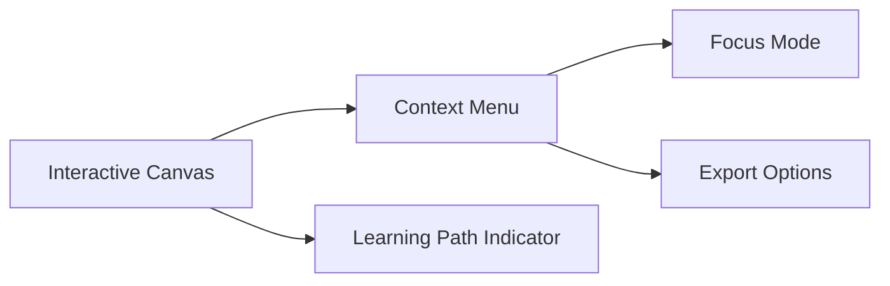
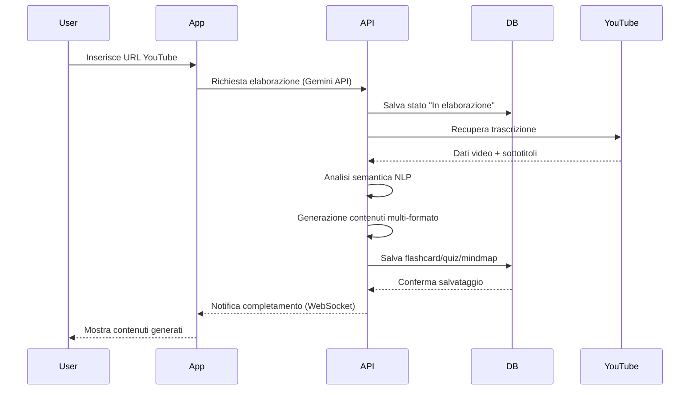
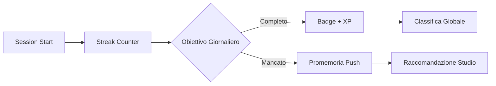
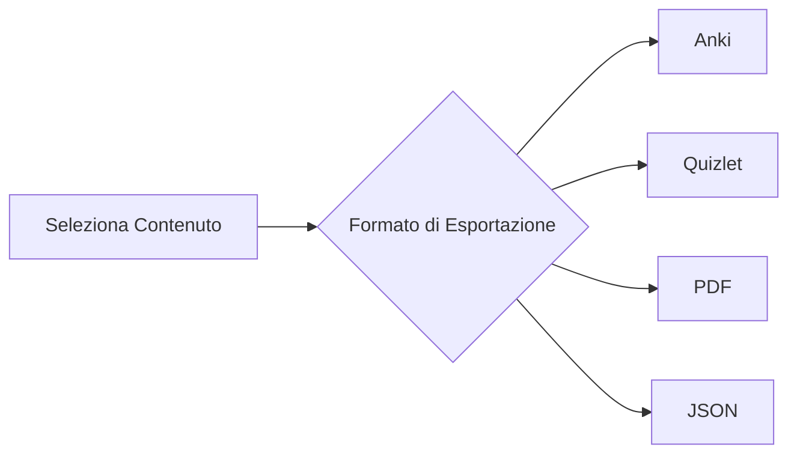
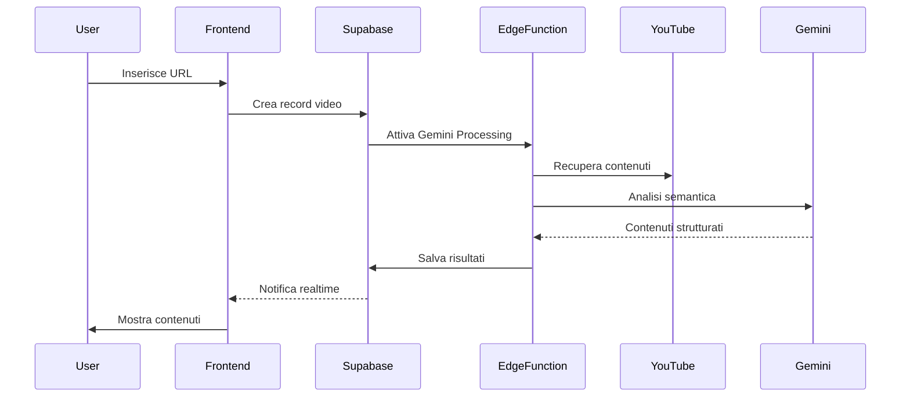

# FlashNote EDU 🎓📱

*Documentazione Tecnica Completa v2.0*

> Trasforma video-lezioni YouTube in flashcard e quiz adattivi in meno di 30 secondi

---

## 📋 Executive Summary

### Panoramica del Progetto

FlashNote EDU è un'applicazione mobile rivoluzionaria che trasforma l'apprendimento digitale convertendo automaticamente video educativi di YouTube in **flashcard intelligenti**, **quiz adattivi**, **mappe mentali interattive** e **riassunti strutturati**. L'app utilizza intelligenza artificiale avanzata per estrarre contenuti chiave e creare materiali di studio personalizzati con **sistema di ripetizione dilazionata (Spaced Repetition)** scientificamente provato per massimizzare la ritenzione a lungo termine.

### 🎯 Analisi del Problema

* **Gap di Mercato**: Il 90% degli studenti utilizza strumenti AI per studiare ma mancano soluzioni integrate mobile-first
* **Frammentazione**: Nessuna app unisce efficacemente "video → flashcard + quiz" con elementi di gamification e spaced repetition
* **Limitazioni Esistenti**: Google offre riassunti video ma non spaced repetition personalizzata
* **Tempo Sprecato**: Gli studenti perdono ore a creare manualmente flashcard da video lunghi

### 💡 Proposta di Valore Unica

* **Velocità Estrema**: Trasformazione completa in < 30 secondi da video a contenuti di studio
* **Multi-formato Intelligente**: Flashcard, quiz, mappe mentali, riassunti tutti generati simultaneamente
* **Spaced Repetition Integrato**: Flashcard e quiz sono organizzati in un sistema di ripetizione dilazionata, con notifiche intelligenti per lo studio ottimale
* **Gamification Avanzata**: Streaks, badge, classifiche e statistiche dettagliate
* **Interoperabilità Totale**: Export verso Anki, Quizlet, PDF e altri formati standard
* **Mobile-first Design**: Esperienza ottimizzata specificamente per smartphone e tablet

---

## 🎓 Funzionalità Core

### 📚 Sistema di Generazione Contenuti AI

#### 📚 **Flashcard Intelligenti**

**Processo di Creazione**

1. **Estrazione Trascrizioni**: Utilizzo API YouTube per ottenere sottotitoli automatici/manuali
2. **Analisi Semantica**: Elaborazione NLP per identificare concetti chiave, definizioni, esempi
3. **Tassonomia di Bloom**: Classificazione domande per livelli cognitivi (ricordare, comprendere, applicare, analizzare, valutare, creare)
4. **Ottimizzazione Contesto**: Bilanciamento lunghezza domande/risposte per la lettura su mobile
5. **Spaced Repetition**: Ogni flashcard è inserita automaticamente in un sistema di ripetizione dilazionata, secondo l’algoritmo SM-2 (usato da Anki) per ottimizzare la memoria a lungo termine. L’utente riceve promemoria personalizzati per ripetere le flashcard al momento giusto.

**Tipi Supportati**

* **Definizioni**: "Cos'è X?" → Spiegazione concisa con esempi
* **Applicazioni**: "Come si usa X?" → Passaggi procedurali con contesto
* **Confronti**: "Differenza tra X e Y?" → Tabelle comparative
* **Cause-Effetto**: "Perché accade X?" → Relazioni causali
* **Esempi**: "Esempio di X?" → Casi di studio concreti

**Metadati Avanzati**

* Timestamp precisi per riferimenti al video originale
* Punteggio di difficoltà basato sulla complessità linguistica
* Tag automatici per la categorizzazione
* Punteggio di confidenza dell'AI sull'accuratezza
* Collegamenti semantici tra flashcard correlate

#### 📚 **Quiz Adattivi Multi-Formato**

**Scelta Multipla Intelligente**

* Generazione di distrattori plausibili basati su errori comuni
* Bilanciamento della difficoltà attraverso analisi statistica
* Feedback immediato con spiegazioni dettagliate
* Domande adattive basate sulla cronologia delle prestazioni
* **Spaced Repetition su Quiz**: Le domande a cui l’utente risponde erroneamente vengono automaticamente reinserite nel ciclo di ripetizione dilazionata, così da essere riproposte nei momenti ottimali per il ripasso.

**Cloze Deletion (Completamento di Spazi Vuoti)**

* Identificazione automatica di parole chiave critiche
* Spazi vuoti multipli per frasi complesse
* Suggerimenti progressivi per supportare l'apprendimento
* Variazioni con sinonimi per un test completo

**Vero/Falso con Giustificazioni**

* Affermazioni basate su fatti estratti dal video
* Richiesta di giustificazione per ogni risposta
* Analisi del ragionamento dell'utente per feedback personalizzato
* Database di errori comuni per miglioramento continuo

**Scala di Difficoltà Dinamica**

* Tracciamento delle prestazioni in tempo reale per aggiustamenti
* Machine learning per la previsione del livello di sfida ottimale
* Personalizzazione basata sullo stile di apprendimento individuale
* A/B testing continuo per l'ottimizzazione degli algoritmi

#### 📚 **Mappe Mentali Automatiche**

**Struttura Gerarchica Intelligente**

* Concetti principali identificati tramite analisi di frequenza
* Sotto-argomenti organizzati per flusso logico
* Livelli di profondità ottimizzati per la visualizzazione su mobile
* Riferimenti incrociati tra rami correlati

**Connessioni Semantiche**

* Word embedding per il rilevamento della similarità
* Mappatura delle relazioni causali
* Sequenze temporali per argomenti cronologici
* Dipendenze dei prerequisiti per i percorsi di apprendimento

**Visualizzazione Interattiva**

* Gesti touch per una navigazione fluida
* Zoom e pan per l'esplorazione dei dettagli
* Comprimi/espandi nodi per la gestione del focus
* Codifica a colori per la differenziazione delle categorie

**Capacità di Esportazione**

* JSON strutturato per integrazioni esterne
* Grafica vettoriale SVG per qualità di stampa
* PNG rasterizzato per la condivisione sui social
* HTML interattivo per l'incorporamento web

#### 📚 **Riassunti Strutturati Multi-Livello**

**Organizzazione Gerarchica**

* Sommario esecutivo (2-3 frasi)
* Concetti principali (punti elenco prioritari)
* Spiegazioni dettagliate con esempi
* Punti chiave e azioni da intraprendere

**Evidenziazione Intelligente**

* Evidenziazione di parole chiave basata sull'importanza
* Citazioni dirette dal video con timestamp
* Dati statistici e numeri chiave
* Definizioni di termini tecnici

**Timeline Navigabile**

* Organizzazione cronologica degli argomenti
* Link per passare direttamente a punti specifici del video per approfondimenti
* Indicatori di progresso per il tracciamento del completamento
* Segnalibri per riferimenti rapidi

## ♻️ Spaced Repetition System (Ripetizione Dilazionata)

> **Cos'è lo Spaced Repetition?**
>
> È una metodologia di apprendimento che ottimizza il ripasso distribuendo le sessioni nel tempo, in modo da rafforzare la memoria a lungo termine. L'algoritmo SM-2, usato da FlashNote EDU (e Anki), regola quando ripetere ogni flashcard o quiz, aumentando l'intervallo tra i ripassi in base alla performance dell'utente.

**Come Funziona in FlashNote EDU:**

* Ogni contenuto (flashcard o quiz) viene assegnato a una "fascia di ripetizione" basata sullo storico delle risposte.
* Se sbagli una domanda, la rivedrai presto. Se la sai bene, la rivedrai dopo intervalli più lunghi.
* Ricevi notifiche push e suggerimenti dinamici per mantenere alta la ritenzione senza sovraccaricarti.
* Puoi sincronizzare il tuo progresso con Anki o esportare lo storico di ripetizione.

**Benefici:**

* Memorizatione rapida senza stress
* Ritenzione ottimale dei concetti chiave
* Pianificazione automatica del ripasso giornaliero

---

## 🏗️ Architettura Tecnica Dettagliata

# 🏗️ Stack Tecnologico + 🤖 AI Content Flow — FlashNote EDU

## 📱 1. Frontend Mobile (React Native)

> App mobile-first per dispositivi iOS e Android

* **Framework**: React Native `v0.72+` con `TypeScript strict mode`
* **Bundler**: Metro + transform custom per performance e dimensioni ridotte
* **Debug**: Flipper per ispezione rete, database e profiling
* **OTA Update**: CodePush per aggiornamenti automatici senza store

**Navigazione & Stato**:

* React Navigation 6 (type-safe, deep linking)
* Redux Toolkit (slice modulari) + React Query (caching, refetching, optimistic UI)
* AsyncStorage (persistenza locale)

**UI/UX**:

* React Native Elements (design system personalizzato)
* Reanimated 3 + Gesture Handler per animazioni a 60fps
* Vector Icons (ottimizzate per performance)

**Performance**:

* `React.memo`, `useMemo`, `useCallback`
* Virtualizzazione FlatList e lazy loading immagini
* Code splitting e bundle splitting

---

## 🧩 2. Backend (Supabase)

> Database, autenticazione, API serverless, real-time, analytics

* **Database**: PostgreSQL con tabelle:

  * `users`, `videos`, `flashcards`, `quiz_items`, `summaries`, `mindmaps`
  * `study_sessions`, `user_progress` per analytics e gamification

* **Edge Functions (Deno)**:

  * Integrazione diretta con **API Gemini**
  * Parsing video, analisi semantica, salvataggio dati strutturati
  * Webhooks per aggiornamenti da YouTube e attività utente
  * Batch processing per video lunghi

* **Realtime**:

  * Pub/Sub PostgreSQL per sessioni collaborative e leaderboard
  * RLS (Row Level Security) per privacy
  * Connection pooling per alta concorrenza

---

## 🤖 3. AI Content Generation Flow (API Gemini)

### 📥 3.1 Input: YouTube Video

* L’utente inserisce un link o carica un file
* Supabase recupera metadati (API YouTube)
* Usa trascrizioni automatiche/manuali, se disponibili

### 🔊 3.2 Trascrizione + Comprensione

* Video inviato a **Gemini API**
* Gemini esegue:

  * Trascrizione audio con timestamp
  * Analisi semantica del contenuto

### 🧠 3.3 Generazione Contenuti

* Prompt strutturati per generare:

  * **📚 Flashcard**
  * **📚 Quiz**
  * **📚 Mappe mentali**
  * **📚 Riassunti strutturati**

### 🗂️ 3.4 Salvataggio su Supabase

* Contenuti salvati in `flashcards`, `summaries`, `mindmap_data`, `quiz_items`
* Con metadati: `confidence_score`, `timestamp`, `user_id`, `Gemini_model_version`

### 🔄 3.5 Notifica Realtime al Client

* React Native riceve evento realtime
* UI aggiornata con i nuovi contenuti generati

---

## ✅ Vantaggi dell’Architettura

| Area               | Vantaggio                                              |
| ------------------ | ------------------------------------------------------ |
| **Modularità**     | Separazione tra front, backend e AI                    |
| **Velocità**       | Generazione contenuti < 30 secondi                     |
| **Manutenibilità** | Funzioni isolate per Gemini e YouTube                  |
| **Realtime UX**    | Notifiche live su completamento contenuti              |
| **AI-Powered**     | Trascrizione e generazione contenuti 100% Gemini-based |

## 🧹 UI Schema (Mobile-First Design)

### 🏠 Home Screen

### 📚 Flashcard Detail

* **Header**: Video Title + Timestamp

* **Card Front**:

  * Question Type Badge (🧠 Definition / 🧪 Application / 🔍 Comparison)
  * Question Text

* **Card Back**:

  * Detailed Answer with Examples
  * Semantic Links (Related Cards)
  * Confidence Slider (1-5)

* **Footer Controls**:

  * ❮ Previous | Next ❯
  * 🔁 Regenerate | 📤 Export

* **Spaced Repetition Controls**:

  * 🕒 Mostra la prossima data di ripasso
  * 🔔 Notifica per il ripasso odierno

### 🧪 Quiz Interface

* **Ripasso Quiz (Spaced Repetition):**

  * L’interfaccia quiz integra un indicatore visivo per le domande da ripetere oggi, secondo l’algoritmo di spaced repetition.

### 🧠 Mindmap Viewer

### ♻️ Core Flow Architecture

#### ⭯️ Main Workflow

### 📊 Gamification System Flow

### 📦 Export Flow

### ⚙️ Technical Flow Integration

### 📊 Analytics Dashboard Schema

**Progress Overview**:

* Mastery Percentage Circle
* Time Spent Chart (Daily/Weekly)
* **Content Performance**:

  * Flashcard Accuracy Heatmap
  * Quiz Difficulty Map
* **Spaced Repetition Analytics**:

  * Numero di contenuti in ripasso oggi
  * Storico dei ripassi riusciti e falliti
  * Previsione prossime sessioni di ripasso
